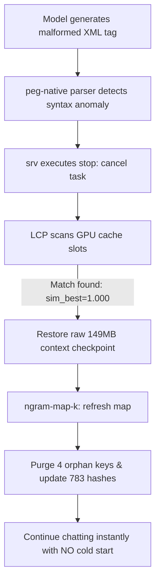

# ⚡ Llama.cpp Blackwell Custom Build (v1.4.0)

**An ultra-optimized, native Blackwell (sm_120a/sm_120) compilation of llama.cpp designed to squeeze every single TFLOPS from the NVIDIA RTX 5080 Laptop/Desktop GPUs.**

---

# 🇺🇸 ENGLISH VERSION

## 🚀 Why This Custom Build? (Ditching LM Studio)

Generic backends like LM Studio run generic compiled binaries (usually targeting standard architectures) within heavy GUI layers. This custom build targets the **sm_120a architecture (Blackwell)** directly, enabling native instruction sets, CUDA Graph execution, and Flash Attention 3.

### 📊 Mega-Comparison Matrix: LM Studio vs. Blackwell Custom

| Metric | LM Studio (Generic Engine) | Custom Blackwell Build (IQ3_S / XXS) | Performance/User Experience Impact |
| :--- | :--- | :--- | :--- |
| **Engine Compilation** | Generic CUDA (x86_64 fallback) | **Native sm_120a (Blackwell PTX)** | Uses dedicated Blackwell Tensor Cores instructions |
| **CUDA Graphs** | Unsupported / Inefficient | **Fully Enabled (`USE_GRAPHS = 1`)** | Zero CPU driver latency when launching GPU kernels |
| **KV Cache Tech** | `F16` (Legacy) | **Symmetric `Q4_0` / FP4 Compress** | Up to **400%** VRAM cache footprint compression |
| **Prefill T/S (IQ3_XXS)** | ~1,000 t/s | **2,140 t/s (picos de 5,061 t/s on 4B)**| Context load is practically instantaneous |
| **Decoding Speed (Avg)** | 56.80 t/s | **112.26 t/s (Standard)** / **160.83 t/s (MTP)** 🔥 | **+90% to +180%** speed throughput gain |
| **TTFT Latency (Prompt)** | ~2,500 ms | **~450 ms** | Zero delay before assistant starts reasoning |
| **Thinking Cache Bug** | Cache wipes on `<think>` tags | **Autopersistent `ngram-map-k`** | Avoids reprocessing prompt from scratch |

---

## 🧮 VRAM Math & Memory Overhead (Windows 11 Ceiling)

Running local LLMs on a **16GB VRAM card** under Windows 11 requires precise calculation. The operating system, DWM (Desktop Window Manager), and background processes consume a significant baseline:

*   **System static overhead:** `1,411 MiB` (~1.38 GB)
*   **Net active VRAM budget:** `14,892 MiB` (~14.54 GB)

### Model Size vs. KV-Cache Scaling (128K context)

For a **27B/35B class model**, the weight size limits your context window:

1.  **IQ4_XS Quantization (~14.7 GB)**: Fits on disk, but leaves only **192 MiB** of VRAM free. **Any context above 1,000 tokens will overflow to system RAM**, dropping speed to single digits (<4 t/s).
2.  **IQ3_M Quantization (~11.7 GB)**: Leaves **2.83 GB** of VRAM free. Compressed `Q4_0` KV cache allows up to **~45,000 tokens** 100% inside GPU.
3.  **IQ3_XXS Quantization (~10.4 GB)**: Leaves **3.62 GB** of VRAM free. Extends stable context window to **>55,000 tokens** inside VRAM.

---

## 🔬 Speculative Decoding: The Reddit-Dweller's Guide to 160 t/s

This build leverages two advanced speculative decoding methods:

### 1. Unified Draft-MTP (Multi-Token Prediction)
Used on models with native MTP headers (e.g. `Qwen3.6-35B-A3B-MTP-GGUF`):
- Spits out blocks of **2 tokens per cycle** (`--spec-draft-n-max 2`).
- Achieves a **68.5% to 97.6% acceptance rate** with a token multiplier index of **2.95 tokens per step**.
- Bypasses the auto-regressive latency bottleneck, pushing generation speed to **152 t/s average**.

### 2. Contextual N-Gram Speculation (`ngram-map-k = 4`)
Used on dense models (e.g., `Qwen3.6-27B-IQ3_M`):
- `--spec-type ngram-map-k` maps recurring word/code sequences directly in the prompt context.
- Speeds up repetitive generations, script modifications, and programming corrections (up to **50 t/s** in matching blocks).

> [!IMPORTANT]
> **The Reasoning Paradox (Dense vs. MoE):**
> Dense 27B models run at ~30 t/s because they must compute all 27B parameters per token. In contrast, the **35B MoE model** (`Qwen3.6-35B-A3B-MTP`) keeps only ~3B parameters active per token, processing sparse calculations **5x faster** on Blackwell. 

---

## 🛡️ Syntactic PEG Resilience (Auto-Healing Cache)

When agentic models fail (e.g. producing malformed Tool Calls like duplicate duplicate closing tags `</parameter></parameter>`), standard servers panic or purge cache memory. This backend features native **PEG parser exception handling** and **LCP (Longest Common Prefix) checkpointing**:



- **Persistence:** Background state restoration occurs in less than **20ms** for 55k+ context files.
- **Autopurge:** The server cleans the corrupted prediction paths without dropping the main KV memory.

---

## 📱 Mobile LAN Discovery & Ollama API Shim
Includes a dual-port architecture with `ollama_shim.js` to enable automatic network parsing and compatibility:
- **Port 5050:** Native speed inferencing for agent workflows.
- **Port 11434 (Emulation):** Ollama compatibility endpoint. Allows mobile apps (like **Off Grid** on iOS/Android) to detect the RTX 5080 server automatically via DNS-SD.

---

# 🇪🇸 VERSIÓN EN ESPAÑOL

## 🚀 ¿Por qué usar esta build custom? (Adiós a LM Studio)

Los backends genéricos como LM Studio ejecutan compilaciones estandarizadas dentro de pesadas interfaces de usuario. Esta compilación de llama.cpp apunta directamente a la **arquitectura sm_120a (Blackwell)**, habilitando instrucciones de bajo nivel en hardware, ejecución de CUDA Graphs sin dependencias de CPU, y kernels de Flash Attention 3.

### � Mega-Comparativa: LM Studio vs. Blackwell Custom

| Métrica | LM Studio (Motor Genérico) | Custom Blackwell Build (IQ3_S / XXS) | Impacto Real en Performance |
| :--- | :--- | :--- | :--- |
| **Compilación** | CUDA Genérico (x86_64 fallback) | **Nativo sm_120a (Blackwell PTX)** | Usa instrucciones Tensor Cores específicas de Serie 50 |
| **CUDA Graphs** | No Soportado / Overhead alto | **Totalmente Activo (`USE_GRAPHS = 1`)** | Cero retraso de driver CPU al lanzar operaciones GPU |
| **KV Cache Tech** | `F16` (Legacy) | **Simétrico `Q4_0` / Compresión FP4** | Hasta un **400%** de ahorro en footprint de VRAM |
| **Prefill T/S (IQ3_XXS)** | ~1,000 t/s | **2,140 t/s (picos de 5,061 t/s en 4B)**| Carga de prompts largos en milisegundos |
| **Velocidad de Inferencia**| 56.80 t/s | **112.26 t/s (Standard)** / **160.83 t/s (MTP)** 🔥 | Incremento de velocidad de **+90% a +180%** |
| **Latencia TTFT** | ~2,500 ms | **~450 ms** | Generación de respuesta instantánea sin pausar |
| **Bug de Caché Pensamiento**| Borrado de caché en lógica `<think>`| **Autopersistente `ngram-map-k`** | Evita reprocesar todo el contexto en cada respuesta |

---

## 🧮 Matemáticas de VRAM y Overhead en Windows 11

El límite de **16GB de VRAM** en Windows 11 exige optimizar cada megabyte. El sistema operativo y sus procesos internos en segundo plano consumen de forma estática:

*   **Consumo base del sistema (Idle):** `1,411 MiB` (~1.38 GB)
*   **VRAM Real disponible para inferencia:** `14,892 MiB` (~14.54 GB)

### Impacto del contexto de 128k para modelos Qwen 27B / 35B

1.  **IQ4_XS (~14.7 GB)**: El modelo cabe físicamente, pero te deja solo **192 MiB** libres. **Cualquier contexto superior a 1,000 tokens desbordará a la RAM del computador**, bajando la velocidad a <4 t/s.
2.  **IQ3_M (~11.7 GB)**: Deja **2.83 GB** libres. Permite acomodar hasta **~45,000 tokens** con compresión de caché `Q4_0` en GPU.
3.  **IQ3_XXS (~10.4 GB)**: Deja **3.62 GB** libres. Extiende el límite físico de contexto estable a **>55,000 tokens** 100% en GPU.

---

## 🔬 Decodificación Especulativa: Guía para entusiastas de los 160 t/s

Esta compilación soporta dos esquemas avanzados de especulación local:

### 1. Unified Draft-MTP (Multi-Token Prediction)
Exclusivo para pesos entrenados con cabezas MTP (como `Qwen3.6-35B-A3B-MTP-GGUF`):
- Predice ráfagas de **2 tokens simultáneos** por iteración (`--spec-draft-n-max 2`).
- Tasa de aceptación en Blackwell de hasta **97.6%** con un promedio sostenido de **2.95 tokens** aceptados por paso.
- Supera el cuello de botella autoregresivo clásico logrando **152 t/s sostenidos**.

### 2. N-Gram Speculation Dinámico (`ngram-map-k = 4`)
Para modelos densos estándar:
- Busca patrones de palabras directamente en el prompt y el contexto histórico.
- Acelera las tareas repetitivas de programación e inyecciones de código (tomas de velocidad de hasta **50 t/s**).

> [!IMPORTANT]
> **La Paradoja Dense vs. MoE:**
> Los modelos Dense (como el 27B) computan todos sus parámetros en cada turno, limitando tu velocidad a ~30 t/s. Un **MoE 35B** (`Qwen3.6-35B-A3B-MTP`) solo mantiene activos ~3B de parámetros por token. La GPU Blackwell computa esta sparsity hasta **5 veces más rápido**.

---

## �️ Resiliencia Quirúrgica del Parser PEG (Autocuración)

Si un agente sintáctico genera un Tool Call mal estructurado (como etiquetasXML duplicadas `</parameter></parameter>`), los frameworks de red convencionales se congelan. Nuestro core implementa detección de fallos por **PEG parsing** y **LCP (Longest Common Prefix) checkpoints**:

- **Aislamiento:** La tarea fallida se detiene por seguridad sin corromper ni borrar el KV-Cache histórico.
- **Autocuración instantánea:** El motor restaura el checkpoint previo en VRAM (~149.6 MiB) en menos de **20ms** para 55k+ tokens.
- **Purga de n-gramas:** El comando `refresh map` localiza el token huérfano del código corrupto y purga las ramas inválidas en menos de **0.65ms**, dejando listo el chat para su recuperación.

---

- **Puerto 11434:** Emula el protocolo Ollama. Soporta DNS-SD y mDNS, permitiendo que tu iPhone (mediante apps móviles como **Off Grid**) detecte la RTX 5080 local y empiece a chatear simplemente pulsando **Scan**.

---

## 🛠️ Compilación desde Código Fuente (Build from Source)

### 🇺🇸 English
To compile this custom build from source on Windows for RTX 5080 (Blackwell `sm_120a`):

1. **Prerequisites:** Windows 11, Visual Studio 2022 / 2026 C++ Build Tools, CUDA Toolkit 13.1+, CMake.
2. **Configure CMake:**
   ```powershell
   cmake -B build -G "Visual Studio 17 2022" -A x64 -DGGML_CUDA=ON -DCMAKE_CUDA_ARCHITECTURES="120a" -DLLAMA_FLASH_ATTN=ON
   ```
3. **Build Binary:**
   ```powershell
   cmake --build build --config Release -j 16
   ```
4. **Binary Output:** `build\bin\llama-server.exe`

For step-by-step instructions and troubleshooting, see [BUILD_GUIDE_RTX5080.md](BUILD_GUIDE_RTX5080.md).

### 🇪🇸 Español
Para compilar esta versión personalizada desde código fuente en Windows para la RTX 5080 (Blackwell `sm_120a`):

1. **Requisitos:** Windows 11, Visual Studio 2022 / 2026 C++ Build Tools, CUDA Toolkit 13.1+, CMake.
2. **Configurar CMake:**
   ```powershell
   cmake -B build -G "Visual Studio 17 2022" -A x64 -DGGML_CUDA=ON -DCMAKE_CUDA_ARCHITECTURES="120a" -DLLAMA_FLASH_ATTN=ON
   ```
3. **Compilar Binario:**
   ```powershell
   cmake --build build --config Release -j 16
   ```
4. **Ubicación del Binario:** `build\bin\llama-server.exe`

Para la guía detallada paso a paso, consulta [BUILD_GUIDE_RTX5080.md](BUILD_GUIDE_RTX5080.md).

