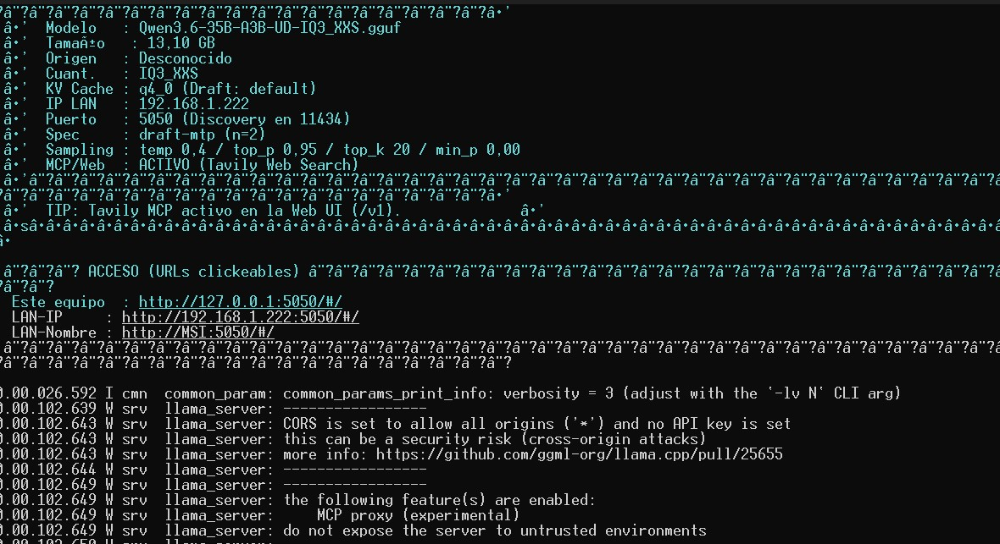
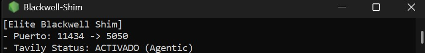
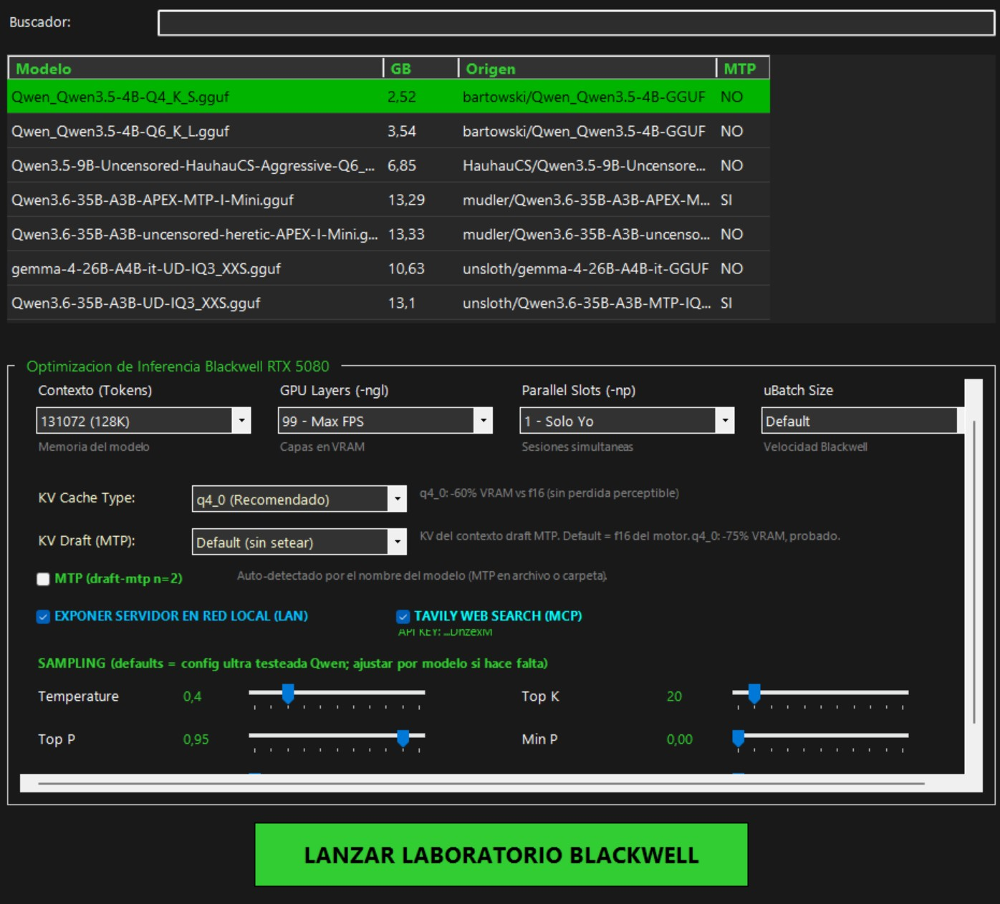

# ⚡ Llama.cpp for 5080 Blackwell Custom Build Marbycore

> **Performance highlights (RTX 5080 Blackwell, Qwen3.6-35B-A3B IQ3_XXS)**  
> 196 tokens/second peak decode burst (MTP, local session measurement)  
> 146.3 tokens/second sustained generation (18,565 tokens continuous)  
> ~1,700 tokens/second prompt processing prefill speed  
> 95.58% MTP draft acceptance rate (2.91 tokens/step multiplier)

[](https://developer.nvidia.com)
[](analisis_rendimiento_qwen35b.md)
[](analisis_rendimiento_qwen35b.md)
[](https://developer.nvidia.com/cuda-toolkit)
[](https://github.com/marbycore/llama_cpp_custom_for_5080_blackwell_windows/releases)



**A native Blackwell (`sm_120a` / `sm_120`) zero-configuration portable release of llama.cpp for NVIDIA RTX 5080 Laptop & Desktop GPUs.**

---

# 🇺🇸 ENGLISH VERSION

## 🎯 What Is This?

A **Windows-first, double-click-and-run** llama.cpp distribution for NVIDIA RTX 5080 (Blackwell) with:

- **Native `sm_120a-real` kernels** (CUDA 13.1) — the same engine, compiled for the exact silicon.
- **MTP speculative decoding** (`draft-mtp n=2`) auto-detected from the model's name — no flags to remember.
- An **ultra-light C# dashboard** to set everything visually, plus a **headless CLI mode** for agents and automation.
- An **Ollama-compatible shim** so third-party apps (e.g. Open WebUI, Continue, offgrid) think they're talking to a real Ollama server.
- **Tavily web search** (MCP proxy) with the API key read from an environment variable — never exposed in files or URLs.

> [!IMPORTANT]
> **All benchmark numbers in this repo were achieved with the `Qwen3.6-35B-A3B` IQ3_XXS (3.44 bpw) GGUF** — the quant that fits comfortably in 16 GB VRAM while keeping the KV cache for long context, and that delivers the highest MTP acceptance rates.

## 🚀 Why This Custom Build? (Ditching LM Studio)

Generic engines like LM Studio execute generic CUDA binaries inside heavy UI frameworks. This fork targets **NVIDIA Blackwell (`sm_120a-real`)** at the PTX level: native Tensor Core instructions, zero-overhead CUDA Graph execution, Universal FlashAttention-3 for all quantizations, and automatic GPU P-state clock locking.

| Performance Metric | LM Studio | Standard llama.cpp | **Custom Blackwell Build** |
| :--- | :--- | :--- | :--- |
| **CUDA Target** | Generic fallback | Standard | **Native `sm_120a-real` (Blackwell PTX)** |
| **GPU Clock Locking** | Dynamic (throttles) | Manual | **Auto P-State Lock (3090 MHz / 14001 MHz)** ⚡ |
| **FlashAttention-3** | FP16 only | FP16 / Partial | **Universal FA3 (all GGUFs)** |
| **Speculative Engine** | Disabled | N-Gram only | **Draft-MTP (`n=2`) + N-Gram** |
| **Decoding Speed (35B)** | 56.80 t/s | 108.00 t/s | **146.3 t/s sustained / 196 t/s burst** |
| **Prompt Prefill (IQ3)** | ~1,000 t/s | ~1,200 t/s | **~1,700 t/s (peaks 2,196 t/s)** |

## 🧩 Key Features

### 1. 🤖 Ollama-Compatible Shim (Zero-Overhead Middleware)
`ollama_shim.js` listens on port **11434** (Ollama's default) and transparently proxies to `llama-server` on **5050**. Third-party apps that only speak Ollama's API — Open WebUI, Continue, offgrid, etc. — connect as if a real Ollama were running. No code changes needed on their side.
- **Tavily integration**: the shim intercepts tool/function calls and answers them with real web-search results from Tavily, so agentic apps get live internet search without extra configuration.



### 2. 🌐 Direct LAN Access via llama.cpp Web UI
You don't need the shim for direct access: the built-in `llama-server` Web UI is exposed at `http://<device>:5050` (and `http://<LAN-IP>:5050` when LAN exposure is enabled in the dashboard). Perfect for testing from another phone, tablet or machine on your network — including the Tavily MCP search in the Web UI.

### 3. 🔍 Tavily Web Search (MCP) — API Key Never Exposed
- Enabled by default through the MCP proxy (`--ui-mcp-proxy`).
- The key is read from the `TAVILY_API_KEY` **environment variable** — it is never written to files, configs or URLs, and the dashboard shows only its last 6 characters.
- With no key set, everything still works — just without web search.

### 4. 🎛️ Ultra-Light C# Dashboard (`launcher_gui.ps1`)
A Windows Forms GUI where you set **everything** visually:



- Model picker (browses your GGUF folders, shows size + MTP capability per model).
- Context, GPU layers, parallel slots, uBatch.
- KV cache type (`q4_0` / `f16`) and **draft KV cache** for MTP.
- Sampling sliders: temperature, top_p, top_k, min_p, presence & repeat penalties — defaults are the **tested sweet spot** (`temp 0.4`, `min_p 0.0`).
- LAN exposure toggle and Tavily enable.
- **Remembers your last choice** and **auto-sets MTP** when the selected model has MTP in its name — the fastest config with one click.

### 5. 💨 Minimal Resource Footprint
Unlike other model runners (which keep heavy UI frameworks resident), this launch flow:
1. Opens the light dashboard → picks config → clicks **Launch**.
2. The dashboard closes and **only `llama-server` keeps running in a minimal console window**.
3. Zero GUI overhead while serving: all VRAM/CPU goes to inference.

You get the convenience of a GUI at setup time and the lightness of llama.cpp at runtime.

### 6. 🤖 Headless Mode (for Agents, Tests & Benchmarks)
The same launcher works as a **CLI/API** without any GUI:

```powershell
# Generate a launch configuration (auto-detects MTP from the model name)
powershell -File launcher_gui.ps1 -Headless -ModelPath "C:\models\Qwen3.6-35B-A3B-UD-IQ3_XXS.gguf" -Ctx 131072 -Ngl 99 -Np 1 -Kv q4_0 -KvD default -Lan

# Check status / wait for the server to be ready
powershell -File launcher_gui.ps1 -Headless -Status
powershell -File launcher_gui.ps1 -Headless -WaitReady -Port 5050 -TimeoutSec 180
```

This opens the door for CI/CD pipelines, benchmark harnesses and AI agents to spin up the server and drive it with plain commands.

### 7. 🚀 MTP/DFlash Auto-Detection & "Sweet Spot" Sampling
- The launcher reads the model name/folder and enables the **right speculative engine automatically**: `--spec-type draft-mtp --spec-draft-n-max 2` for MTP-capable Qwen models (e.g. `Qwen3.6-35B-A3B-MTP-*`), `--spec-type draft-dflash --spec-draft-n-max 15 --model-draft <drafter>` for **Muse Glimmer** (auto-finds `dflash-kquant.gguf` next to the model, with Meta's sampling temp 1.0 / top_p 0.95 / top_k 64), otherwise it falls back to `ngram-map-k`.
- Sampling defaults are the result of a controlled A/B test (8 runs, 3 configs): `temp 0.4 + min_p 0.0` produced **2/2 functional carts in under 4 minutes** in the agentic workflow — see `analisis_rendimiento_qwen35b.md`.

### 8. 🧠 Bounded Reasoning Budget for Qwen 3.8 (Chat API /v1)
- The **Qwen 3.8** model series (both censored and uncensored variants) can enter infinite reasoning loops inside the `<think>` tag when processing complex monolithic code prompts.
- The launcher automatically detects models containing `Qwen3.8` and injects a strict **512-token reasoning budget** (`--reasoning-preserve --reasoning-format deepseek --reasoning-budget 512 --reasoning-budget-message "</think>"`).
- This bounds the thinking phase to **~9–12 seconds** when using the Chat API (`/v1/chat/completions`), automatically closing the `<think>` block and triggering continuous code generation immediately at >50 t/s.

## 🏆 Benchmark Highlights (Qwen3.6-35B-A3B IQ3_XXS)

| Metric | Value | Source |
| :--- | :--- | :--- |
| **Decode burst** | **196 t/s** | Peak short burst (MTP) |
| **Sustained generation** | **146.3 t/s** (18,565 tokens) | Task 391, production log |
| **MTP acceptance** | **95.58%** (2.91 tokens/step) | Task 1522 |
| **Prefill** | **~1,700 t/s** (peaks 2,196 t/s) | 19,223-token prompt |
| **Agentic workflow** | **3 min 54 s** landing page (36/36 checks) | 2026-08-03 |

Full methodology and per-task logs: [`analisis_rendimiento_qwen35b.md`](analisis_rendimiento_qwen35b.md).

### 🎯 Muse Glimmer 30B Support (Meta) + DFlash Speculative Decoding

**Fully compatible with Meta's [Muse Glimmer 30B](https://huggingface.co/unsloth/Muse-Glimmer-30B-GGUF) (IQ3_XXS)** + its DFlash drafter (`dflash-kquant.gguf`). The launcher **auto-detects Muse models** (name contains "muse"), enables `--spec-type draft-dflash --spec-draft-n-max 15`, and auto-sets Meta's recommended sampling (`temp 1.0 / top_p 0.95 / top_k 64`) - no flags to remember.

| Metric | Value | Detail |
| :--- | :--- | :--- |
| **Prefill** | **~1,077-1,098 t/s** | 18,916 tokens in 17.5 s |
| **Sustained decode (DFlash)** | **~96-113 t/s** | vs ~30 t/s baseline (~3.2x speedup) |
| **Decode peaks** | **174 / 205 / 129 t/s** | short tasks |
| **Draft acceptance** | **0.39-0.42 avg** (peak 0.84, 13.6 tokens/block) | block_size=16 |
| **Agentic workflow** | **2 min 30 s** | full landing page with cart + configurator |

Same pattern as MTP for Qwen: **auto-detected, zero-config**.

## 📦 Quick Start (Zero-Config, Double-Click)

1. Download `Llama-cpp-Blackwell-RTX5080-v1.6.0-portable-win-cuda13.1-x64.zip` from [Releases](https://github.com/marbycore/llama_cpp_custom_for_5080_blackwell_windows/releases).
2. Unzip anywhere (USB drive works).
3. Double-click **`Llama-Server_RTX5080.bat`** (accept the UAC prompt for GPU clock locking).
4. Pick your model in the GUI — it even finds your `.gguf` files for you.
5. Click **Launch**. Done. No command line required.

## 🛠️ Build From Source

Want to compile it yourself? Everything is here:

```powershell
git clone https://github.com/marbycore/llama_cpp_custom_for_5080_blackwell_windows.git <RUTA_REPO>
cd <RUTA_REPO>
powershell -ExecutionPolicy Bypass -File compilar_para_5080.ps1
```

Manual recipe (verified: CUDA 13.1 + MSVC 19.44 + `sm_120a-real`):

```bat
call "C:\Program Files (x86)\Microsoft Visual Studio\2022\BuildTools\VC\Auxiliary\Build\vcvars64.bat"
cmake -B build -G Ninja -DCMAKE_CUDA_COMPILER="C:/Program Files/NVIDIA GPU Computing Toolkit/CUDA/v13.1/bin/nvcc.exe" -DCMAKE_CUDA_ARCHITECTURES="120a-real" -DCMAKE_CUDA_FLAGS="-allow-unsupported-compiler" -DGGML_CUDA=ON -DGGML_CUDA_FA=ON -DGGML_CUDA_FA_ALL_QUANTS=ON -DGGML_CUDA_GRAPHS=ON -DGGML_NATIVE=OFF -DCMAKE_BUILD_TYPE=Release
cmake --build build --target llama-server llama-bench -j
```

Full bilingual guide with troubleshooting: [`BUILD_GUIDE_RTX5080.md`](BUILD_GUIDE_RTX5080.md).

## 🏗️ Build Provenance

**This fork does NOT modify any core llama.cpp source file** (`src/`, `common/`, `ggml/` are 100% upstream). This repository adds Windows-specific tooling on top of the stock engine.

- **Base:** llama.cpp upstream, commit `3018a11e7`
- **CUDA Toolkit:** 13.1 (Blackwell-native kernels)
- **Compiler:** MSVC 19.44 (VS2022 BuildTools) + `-allow-unsupported-compiler`
- **Architecture:** `sm_120a-real` (native Blackwell PTX)
- **Generator:** Ninja
- **Key flags:** `GGML_CUDA=ON`, `GGML_CUDA_FA=ON`, `GGML_CUDA_FA_ALL_QUANTS=ON`, `GGML_CUDA_GRAPHS=ON`, `GGML_NATIVE=OFF`

The binary is a **tuned instance** of the industrial standard: same engine code, native-hardware compilation. Not "hacked" code — **"tuned"** code.

---

# 🇪🇸 VERSIÓN EN ESPAÑOL

## 🎯 ¿Qué es esto?

Una distribución de llama.cpp **pensada para Windows, de doble clic y listo**, para NVIDIA RTX 5080 (Blackwell), con:

- **Kernels nativos `sm_120a-real`** (CUDA 13.1) — el mismo motor, compilado para el silicio exacto.
- **Decodificación especulativa MTP** (`draft-mtp n=2`) auto-detectada por el nombre del modelo — sin flags que recordar.
- Un **dashboard C# ultra ligero** para setear todo visualmente, más un **modo headless CLI** para agentes y automatización.
- Un **shim compatible con Ollama** para que apps de terceros (Open WebUI, Continue, offgrid, etc.) crean que hablan con un Ollama real.
- **Búsqueda web Tavily** (proxy MCP) con la API key leída de una variable de entorno — nunca expuesta en archivos ni URLs.

> [!IMPORTANT]
> **Todos los números de este repo se lograron con el GGUF `Qwen3.6-35B-A3B` IQ3_XXS (3.44 bpw)** — la cuantización que cabe holgada en 16 GB de VRAM dejando espacio para el KV cache de contexto largo, y la que da las tasas de aceptación MTP más altas.

## 🚀 ¿Por qué esta compilación custom? (Adiós a LM Studio)

Los motores genéricos ejecutan binarios CUDA genéricos dentro de interfaces pesadas. Este fork apunta a **NVIDIA Blackwell (`sm_120a-real`)** a nivel PTX: instrucciones nativas de Tensor Cores, CUDA Graphs sin latencia de CPU, FlashAttention-3 Universal para todas las cuantizaciones y fijación automática de relojes GPU.

| Métrica de Rendimiento | LM Studio | llama.cpp Estándar | **Custom Blackwell Build** |
| :--- | :--- | :--- | :--- |
| **Objetivo CUDA** | Genérico | Estándar | **Nativo `sm_120a-real` (Blackwell PTX)** |
| **Fijación de Reloj GPU** | Dinámico | Manual | **Auto P-State Lock (3090 MHz / 14001 MHz)** ⚡ |
| **FlashAttention-3** | Solo FP16 | FP16 / Parcial | **Universal FA3 (todas las GGUFs)** |
| **Motor Especulativo** | Desactivado | Solo N-Gram | **Draft-MTP (`n=2`) + N-Gram** |
| **Velocidad (35B)** | 56.80 t/s | 108.00 t/s | **146.3 t/s sostenido / 196 t/s ráfaga** |
| **Prefill (IQ3)** | ~1,000 t/s | ~1,200 t/s | **~1,700 t/s (picos 2,196 t/s)** |

## 🧩 Características Principales

### 1. 🤖 Shim Compatible con Ollama (Middleware de Cero Overhead)
`ollama_shim.js` escucha en el puerto **11434** (el de Ollama) y hace proxy transparente hacia `llama-server` en el **5050**. Las apps que solo hablan la API de Ollama — Open WebUI, Continue, offgrid, etc. — se conectan como si hubiera un Ollama real. Sin cambios de código de su lado.
- **Integración Tavily**: el shim intercepta las llamadas a herramientas/funciones y las responde con resultados reales de búsqueda web de Tavily, dando internet en vivo a las apps agénticas sin configuración extra.


### 2. 🌐 Acceso Directo por LAN vía Web UI de llama.cpp
No necesitás el shim para acceso directo: la Web UI de `llama-server` queda en `http://<dispositivo>:5050` (y `http://<IP-LAN>:5050` si activás exposición LAN en el dashboard). Ideal para probar desde otro celular, tablet o máquina de tu red — incluyendo la búsqueda MCP de Tavily en la Web UI.

### 3. 🔍 Búsqueda Web Tavily (MCP) — La API Key Nunca se Expone
- Activada por defecto vía proxy MCP (`--ui-mcp-proxy`).
- La key se lee de la variable de entorno **`TAVILY_API_KEY`** — nunca se escribe en archivos, configs ni URLs; el dashboard muestra solo sus últimos 6 caracteres.
- Sin key configurada, todo sigue funcionando — solo sin búsqueda web.

### 4. 🎛️ Dashboard C# Ultra Ligero (`launcher_gui.ps1`)
Una GUI de Windows Forms donde seteas **todo** visualmente:


- Selector de modelos (explora tus carpetas de GGUFs, muestra tamaño y capacidad MTP por modelo).
- Contexto, capas GPU, slots paralelos, uBatch.
- Tipo de KV cache (`q4_0` / `f16`) y **KV cache del draft** para MTP.
- Sliders de sampling: temperature, top_p, top_k, min_p, presence y repeat penalties — los defaults son el **punto dulce testeado** (`temp 0.4`, `min_p 0.0`).
- Toggle de exposición LAN y de Tavily.
- **Recuerda la última elección** y **auto-setéa el MTP** cuando el modelo seleccionado tiene MTP en el nombre — la config más rápida con un clic.

### 5. 💨 Huella de Recursos Mínima
A diferencia de otros corredores de modelos (que mantienen frameworks pesados residentes), este flujo:
1. Abre el dashboard liviano → elegís config → clic en **Lanzar**.
2. El dashboard se cierra y **solo `llama-server` queda corriendo en una consola shell mínima**.
3. Cero overhead de GUI durante el servicio: toda la VRAM/CPU va a la inferencia.

Tenés la comodidad de una GUI al configurar y la liviandad de llama.cpp al ejecutar.

### 6. 🤖 Modo Headless (para Agentes, Tests y Benchmarks)
El mismo launcher funciona como **CLI/API** sin ninguna GUI:

```powershell
# Generar una configuración de lanzamiento (auto-detecta MTP por el nombre del modelo)
powershell -File launcher_gui.ps1 -Headless -ModelPath "C:\models\Qwen3.6-35B-A3B-UD-IQ3_XXS.gguf" -Ctx 131072 -Ngl 99 -Np 1 -Kv q4_0 -KvD default -Lan

# Consultar estado / esperar a que el server esté listo
powershell -File launcher_gui.ps1 -Headless -Status
powershell -File launcher_gui.ps1 -Headless -WaitReady -Port 5050 -TimeoutSec 180
```

Esto abre la puerta a pipelines de CI/CD, harnesses de benchmark y agentes de IA que levantan el server y lo manejan con comandos simples.

### 7. 🚀 Auto-Detección MTP/DFlash y Sampling del "Punto Dulce"
- El launcher lee el nombre/carpeta del modelo y activa **el motor especulativo correcto automáticamente**: `--spec-type draft-mtp --spec-draft-n-max 2` para modelos Qwen con MTP (ej. `Qwen3.6-35B-A3B-MTP-*`), `--spec-type draft-dflash --spec-draft-n-max 15 --model-draft <drafter>` para **Muse Glimmer** (busca automáticamente `dflash-kquant.gguf` junto al modelo, con el sampling de Meta temp 1.0 / top_p 0.95 / top_k 64); si no, usa `ngram-map-k`.
- Los defaults de sampling son el resultado de un test A/B controlado (8 corridas, 3 configs): `temp 0.4 + min_p 0.0` dio **2/2 carritos funcionales en menos de 4 minutos** en el workflow agéntico — ver `analisis_rendimiento_qwen35b.md`.

### 8. 🧠 Presupuesto de Razonamiento Acotado para Qwen 3.8 (Chat API /v1)
- La serie **Qwen 3.8** (tanto censurada como sin censura) puede entrar en bucles de pensamiento infinito en la etiqueta `<think>` ante prompts de código monolítico complejo.
- El launcher detecta automáticamente modelos con `Qwen3.8` en su nombre e inyecta un **presupuesto estricto de 512 tokens** (`--reasoning-preserve --reasoning-format deepseek --reasoning-budget 512 --reasoning-budget-message ^</think^>`).
- Esto acota la fase de pensamiento a **~9–12 segundos** en la API de Chat (`/v1/chat/completions`), inyectando el cierre `</think>` e iniciando inmediatamente la generación continua de código a >50 t/s.

## 🏆 Destacados de Benchmark (Qwen3.6-35B-A3B IQ3_XXS)

| Métrica | Valor | Fuente |
| :--- | :--- | :--- |
| **Ráfaga de decode** | **196 t/s** | Pico en ráfaga corta (MTP) |
| **Generación sostenida** | **146.3 t/s** (18,565 tokens) | Tarea 391, log de producción |
| **Aceptación MTP** | **95.58%** (2.91 tokens/paso) | Tarea 1522 |
| **Prefill** | **~1,700 t/s** (picos 2,196 t/s) | Prompt de 19,223 tokens |
| **Workflow agéntico** | **3 min 54 s** landing page (36/36 checks) | 2026-08-03 |

Metodología completa y logs por tarea: [`analisis_rendimiento_qwen35b.md`](analisis_rendimiento_qwen35b.md).

### 🎯 Soporte de Muse Glimmer 30B (Meta) + DFlash Speculative Decoding

**Totalmente compatible con el [Muse Glimmer 30B de Meta](https://huggingface.co/unsloth/Muse-Glimmer-30B-GGUF) (IQ3_XXS)** + su drafter DFlash (`dflash-kquant.gguf`). El launcher **auto-detecta modelos Muse** (nombre contiene "muse"), activa `--spec-type draft-dflash --spec-draft-n-max 15`, y ajusta automáticamente el sampling recomendado por Meta (`temp 1.0 / top_p 0.95 / top_k 64`) - sin flags que recordar.

| Métrica | Valor | Detalle |
| :--- | :--- | :--- |
| **Prefill** | **~1,077-1,098 t/s** | 18,916 tokens en 17.5 s |
| **Decode sostenido (DFlash)** | **~96-113 t/s** | vs ~30 t/s baseline (~3.2x más rápido) |
| **Picos de decode** | **174 / 205 / 129 t/s** | tareas cortas |
| **Aceptación draft** | **0.39-0.42 promedio** (pico 0.84, 13.6 tokens/bloque) | block_size=16 |
| **Workflow agéntico** | **2 min 30 s** | landing page completa con carrito + configurador |

Mismo patrón que MTP para Qwen: **auto-detectado, cero configuración**.

## 📦 Inicio Rápido (Zero-Config, Doble Clic)

1. Descargá `Llama-cpp-Blackwell-RTX5080-v1.6.0-portable-win-cuda13.1-x64.zip` desde [Releases](https://github.com/marbycore/llama_cpp_custom_for_5080_blackwell_windows/releases).
2. Descomprimí en cualquier carpeta (funciona desde un pendrive).
3. Doble clic en **`Llama-Server_RTX5080.bat`** (aceptá el aviso UAC para el bloqueo de relojes GPU).
4. Elegí tu modelo en la GUI — incluso encuentra tus archivos `.gguf` por vos.
5. Clic en **Lanzar**. Listo. Sin escribir un solo comando.

## 🛠️ Compilación Desde Código Fuente

¿Querés compilarlo vos mismo? Está todo acá:

```powershell
git clone https://github.com/marbycore/llama_cpp_custom_for_5080_blackwell_windows.git <RUTA_REPO>
cd <RUTA_REPO>
powershell -ExecutionPolicy Bypass -File compilar_para_5080.ps1
```

Receta manual (verificada: CUDA 13.1 + MSVC 19.44 + `sm_120a-real`):

```bat
call "C:\Program Files (x86)\Microsoft Visual Studio\2022\BuildTools\VC\Auxiliary\Build\vcvars64.bat"
cmake -B build -G Ninja -DCMAKE_CUDA_COMPILER="C:/Program Files/NVIDIA GPU Computing Toolkit/CUDA/v13.1/bin/nvcc.exe" -DCMAKE_CUDA_ARCHITECTURES="120a-real" -DCMAKE_CUDA_FLAGS="-allow-unsupported-compiler" -DGGML_CUDA=ON -DGGML_CUDA_FA=ON -DGGML_CUDA_FA_ALL_QUANTS=ON -DGGML_CUDA_GRAPHS=ON -DGGML_NATIVE=OFF -DCMAKE_BUILD_TYPE=Release
cmake --build build --target llama-server llama-bench -j
```

Guía completa bilingüe con troubleshooting: [`BUILD_GUIDE_RTX5080.md`](BUILD_GUIDE_RTX5080.md).

## 🏗️ Procedencia de la Compilación

**Este fork NO modifica ningún archivo core de llama.cpp** (`src/`, `common/`, `ggml/` son 100% upstream). El repositorio agrega tooling específico de Windows sobre el motor estándar.

- **Base:** llama.cpp upstream, commit `3018a11e7`
- **CUDA Toolkit:** 13.1 (kernels nativos Blackwell)
- **Compilador:** MSVC 19.44 (VS2022 BuildTools) + `-allow-unsupported-compiler`
- **Arquitectura:** `sm_120a-real` (PTX Blackwell nativo)
- **Generador:** Ninja
- **Flags clave:** `GGML_CUDA=ON`, `GGML_CUDA_FA=ON`, `GGML_CUDA_FA_ALL_QUANTS=ON`, `GGML_CUDA_GRAPHS=ON`, `GGML_NATIVE=OFF`

El binario es una **instancia ajustada** del estándar industrial: mismo código del motor, compilación nativa de hardware. No es código "modificado" — es código **"ajustado"**.

---

# ============================================================
# README ORIGINAL DE LLAMA.CPP (UPSTREAM) - DOCUMENTACION OFICIAL
# Nuestro README custom esta arriba. Esta seccion es el README
# completo de ggml-org/llama.cpp que viene con cada merge.
# ============================================================

# llama.cpp


<div align="center">

<b>LLM inference in C/C++</b>

[](https://opensource.org/licenses/MIT)
[](https://github.com/ggml-org/llama.cpp/releases)
[](https://github.com/ggml-org/llama.cpp/actions/workflows/server.yml)
[](https://github.com/ggml-org/llama.cpp/actions/workflows/docker.yml)
[](https://github.com/ggml-org/llama.cpp/actions/workflows/winget.yml)

[manifesto](https://github.com/ggml-org/llama.cpp/discussions/205) / [ggml](https://github.com/ggml-org/ggml) / [ops](https://github.com/ggml-org/llama.cpp/blob/master/docs/ops.md) / [maintainer PRs](https://github.com/ggml-org/llama.cpp/issues?q=is%3Apr%20is%3Aopen%20draft%3AFalse%20(author%3Argerganov%20OR%20author%3AKitaitiMakoto%20OR%20author%3Adanbev%20OR%20author%3Aaldehir%20OR%20author%3Amax-krasnyansky%20OR%20author%3ACISC%20OR%20author%3Aggerganov%20OR%20author%3Aam17an%20OR%20author%3Abartowski1182%20OR%20author%3Ahipudding%20OR%20author%3AServeurpersoCom%20OR%20author%3Apwilkin%20OR%20author%3Areeselevine%20OR%20author%3Angxson%20OR%20author%3Ajeffbolznv%20OR%20author%3A0cc4m%20OR%20author%3Aangt%20OR%20author%3AIMbackK%20OR%20author%3Aarthw%20OR%20author%3AJohannesGaessler%20OR%20author%3AORippler%20OR%20author%3Aruixiang63%20OR%20author%3Axctan%20OR%20author%3Aallozaur%20OR%20author%3Ayomaytk%20OR%20author%3Aaendk%20OR%20author%3Agaugarg-nv%20OR%20author%3Ataronaeo%20OR%20author%3Aforforever73%20OR%20author%3Alhez%20OR%20author%3Anetrunnereve%20OR%20author%3Afairydreaming)%20sort%3Aupdated-desc) / [compile times](https://github.com/ggml-org/llama.cpp-dev/blob/master/README-compile-times.md) / [lib llama API](https://github.com/ggml-org/llama.cpp/issues/9289) / [llama-server REST API](https://github.com/ggml-org/llama.cpp/issues/9291)

</div>

## Quick start

A few options to get `llama.cpp` installed on your machine:

- Visit https://llama.app and follow the instructions
- Run with Docker - see our [Docker documentation](docs/docker.md)
- Download pre-built binaries from the [releases page](https://github.com/ggml-org/llama.cpp/releases)
- Build from source by cloning this repository - check out [our build guide](docs/build.md)

Once installed:

```sh
# Download and run a model directly from Hugging Face
llama cli -hf ggml-org/Qwen3.5-0.8B-GGUF

# Launch OpenAI-compatible API server
llama serve -hf ggml-org/Qwen3.5-0.8B-GGUF
```

<table align="center">
    <tr>
        <td align="center" width=50%>
            
            <i>VLM session with <b>llama cli</b></i>
        </td>
        <td align="center">
            
            <i>Built-in web UI against <b>llama serve</b></i>
        </td>
    </tr>
<table>

## Description

The main goal of `llama.cpp` is to enable LLM (and VLM) inference with minimal setup and state-of-the-art performance on
a wide range of hardware - locally and in the cloud.

- Plain C/C++ implementation without any dependencies
- Apple silicon is a first-class citizen - optimized via ARM NEON, Accelerate and Metal frameworks
- AVX, AVX2, AVX512 and AMX support for x86 architectures
- RVV, ZVFH, ZFH, ZICBOP and ZIHINTPAUSE support for RISC-V architectures
- 1.5-bit, 2-bit, 3-bit, 4-bit, 5-bit, 6-bit, and 8-bit integer quantization for faster inference and reduced memory use
- Custom CUDA kernels for running LLMs on NVIDIA GPUs (support for AMD GPUs via HIP and Moore Threads GPUs via MUSA)
- Vulkan and SYCL backend support
- CPU+GPU hybrid inference to partially accelerate models larger than the total VRAM capacity

The `llama.cpp` project is build on top of the [ggml](https://github.com/ggml-org/ggml) library.

## Supported backends

| Backend | Target devices |
| --- | --- |
| [BLAS](docs/build.md#blas-build) | All |
| [BLIS](docs/backend/BLIS.md) | All |
| [CANN](docs/build.md#cann) | Ascend NPU |
| [CUDA](docs/build.md#cuda) | Nvidia GPU |
| [HIP](docs/build.md#hip) | AMD GPU |
| [Hexagon [In Progress]](docs/backend/snapdragon/README.md) | Snapdragon |
| [IBM zDNN](docs/backend/zDNN.md) | IBM Z & LinuxONE |
| [MUSA](docs/build.md#musa) | Moore Threads GPU |
| [Metal](docs/build.md#metal-build) | Apple Silicon |
| [OpenCL](docs/backend/OPENCL.md) | Adreno GPU |
| [OpenVINO [In Progress]](docs/backend/OPENVINO.md) | Intel CPUs, GPUs, and NPUs |
| [RPC](https://github.com/ggml-org/llama.cpp/tree/master/tools/rpc) | All |
| [SYCL](docs/backend/SYCL.md) | Intel GPU |
| [VirtGPU](docs/backend/VirtGPU.md) | VirtGPU APIR |
| [Vulkan](docs/build.md#vulkan) | GPU |
| [WebGPU](docs/build.md#webgpu) | All |
| [ZenDNN](docs/build.md#zendnn) | AMD CPU |

## Documentation

#### Tools

- [cli](tools/cli/README.md)
- [completion](tools/completion/README.md)
- [server](tools/server/README.md)
- [GBNF grammars](grammars/README.md)

#### Development

- [How to build](docs/build.md)
- [Running on Docker](docs/docker.md)
- [Build on Android](docs/android.md)
- [Multi-GPU usage](docs/multi-gpu.md)
- [Performance troubleshooting](docs/development/token_generation_performance_tips.md)
- [GGML tips & tricks](https://github.com/ggml-org/llama.cpp/wiki/GGML-Tips-&-Tricks)
- [XCFramework](docs/xcframework.md)
- [Completions](docs/completions.md)
- [Models](docs/models.md)

## Contributing

- Contributors can open PRs
- Collaborators will be invited based on contributions
- Maintainers can push to branches in the `llama.cpp` repo and merge PRs into the `master` branch
- Any help with managing issues, PRs and projects is very appreciated!
- Read the [CONTRIBUTING.md](CONTRIBUTING.md) for more information

## Acknowledgements

- [yhirose/cpp-httplib](https://github.com/yhirose/cpp-httplib) - Single-header HTTP server, used by `llama-server` - MIT license
- [stb-image](https://github.com/nothings/stb) - Single-header image format decoder, used by multimodal subsystem - Public domain
- [nlohmann/json](https://github.com/nlohmann/json) - Single-header JSON library, used by various tools/examples - MIT License
- [miniaudio.h](https://github.com/mackron/miniaudio) - Single-header audio format decoder, used by multimodal subsystem - Public domain
- [subprocess.h](https://github.com/sheredom/subprocess.h) - Single-header process launching solution for C and C++ - Public domain

